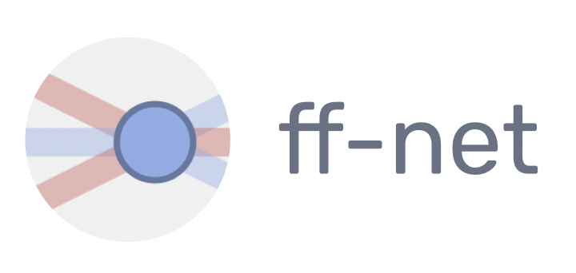
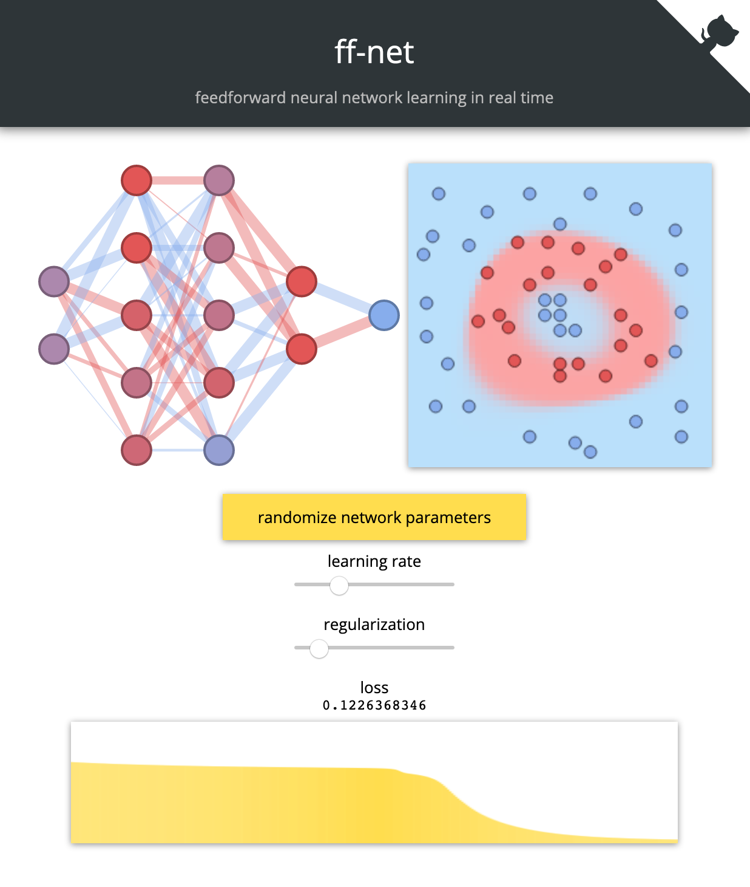
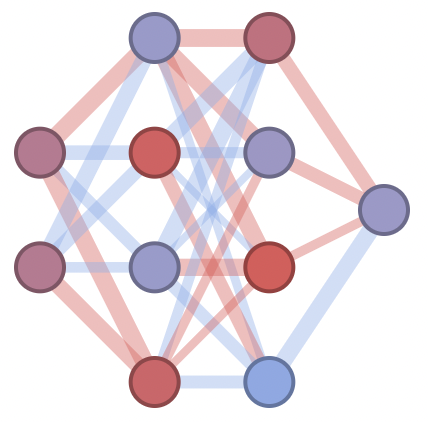
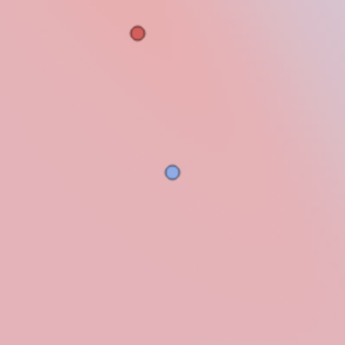
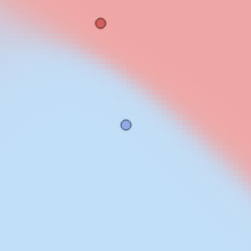

<div align="center">
  
</div>

---

[](https://github.com/juniorrojas/ff-net/actions/workflows/test.yml)

Feedforward neural network learning in real time.

[live demo](http://juniorrojas.github.io/ff-net)

<div align="center">
  
</div>

## Quickstart

To use in the browser, you can use a UMD build that exposes `ffnet` as a global variable.

```html
<script src="ff-net.js"></script>
```

### Sequential

```js
const model = new ffnet.Sequential({
  createDomElement: true,
  width: 300,
  height: 200
});
model.addNeuronGroup(2);
model.addFullyConnectedLayer(4);
model.addFullyConnectedLayer(4);
model.addFullyConnectedLayer(1);
model.randomizeParameters();
document.body.appendChild(model.domElement);
model.render();
```

<div align="center">
  </img>
</div>

### DataCanvas

```js
const dataCanvas = new ffnet.ui.DataCanvas();
dataCanvas.addDataPoint(0.5, 0.5, 1);
dataCanvas.addDataPoint(0.4, 0.1, 0);
dataCanvas.xyToPixel = (x, y) => {
  return model.forward([x, y])[0];
}
document.body.appendChild(dataCanvas.domElement);
dataCanvas.render();
```

<div align="center">
  </img>
</div>


### Sequential.train

```js
setInterval(() => {
  model.train({
    dataPoints: dataCanvas.dataPoints,
    lr: 1e-1,
    iters: 10
  });
  dataCanvas.render();
}, 1000 / 60);
```

<div align="center">
  </img>
</div>
