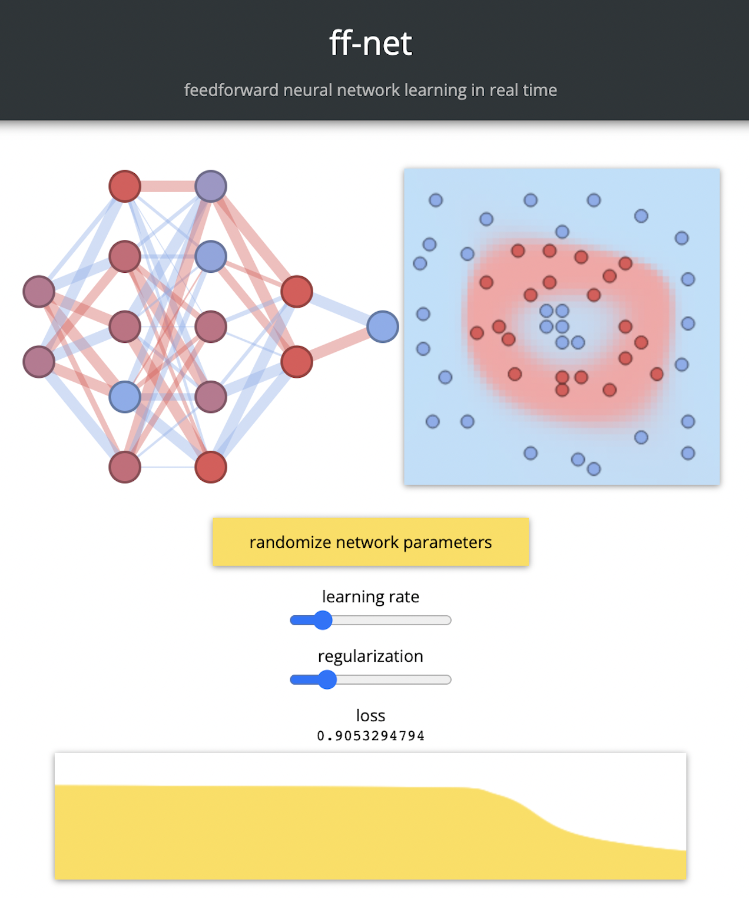

# <div style="display:flex;align-items:center;">ff-net</div>

---

[](https://github.com/juniorrojas/ff-net/actions/workflows/test.yml)

Feedforward neural network learning in real time.

[live demo](http://juniorrojas.github.io/ff-net)



## build demo

```
cd demo
```

Install dependencies

```
npm ci
```

Watch source for development

```
npm run watch
```

Open `index.html`

Build and publish to `gh-pages`

```
npm run build
./scripts/deploy --push
```